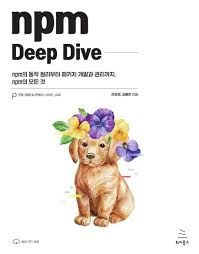

<h1> npm deep dive 🤿 </h1>

### Chapter 02 package.json과 npm 파헤치기

| Item |                                Discussion                                | Date    | Author |
| :--: | :----------------------------------------------------------------------: | :------ | :----- |
|  01  |         [package.json 톺아보기](/materials/ch_2/item_1_jieun.md)         | 25.7.31 | 송지은 |
|  02  |       [dependencies란 무엇일까?](/materials/ch_2/item_2_minsug.md)       | 25.7.31 | 채민석 |
|  03  |          [npm의 주요 명령어](/materials/ch_2/item_3_sunhwan.md)          | 25.7.31 | 박선환 |
|  04  | [npm install을 실행하면 벌어지는 일](/materials/ch_2/item_4_seongwon.md) | 25.7.31 | 조성원 |
|  05  |      [node_modules는 무엇일까?](/materials/ch_2/item_5_seongwon.md)      | 25.8.7  | 조성원 |
|  06  |           [bin 필드와 npx](/materials/ch_2/item_6_sunhwan.md)            | 25.8.7  | 박선환 |

### Chapter 03 npm의 대항마 yarn과 pnpm

| Item |                                              Discussion                                              | Date    | Author |
| :--: | :--------------------------------------------------------------------------------------------------: | :------ | :----- |
|  01  |                       [npm의 문제점과 한계](/materials/ch_3/item_1_minsug.md)                        | 25.8.7  | 채민석 |
|  02  |     [yarn: 신속하고 안정적인 패키지 관리를 위한 패키지 관리자](/materials/ch_3/item_2_jieun.md)      | 25.8.7  | 송지은 |
|  03  | [pnpm: 디스크 공간 절약과 설치 속도의 혁신을 가져온 패키지 관리자](/materials/ch_3/item_3_minsug.md) | 25.8.14 | 채민석 |
|  04  |                      [npm, yarn, pnpm 비교](/materials/ch_3/item_4_seongwon.md)                      | 25.8.14 | 조성원 |

### Chapter 04 CommonJS와 ESModule

| Item |                           Discussion                            | Date    | Author |
| :--: | :-------------------------------------------------------------: | :------ | :----- |
|  01  | [자바스크립트 모듈화의 역사](/materials/ch_4/item_1_sunhwan.md) | 25.8.14 | 박선환 |
|  02  |     [CommonJS란 무엇일까?](/materials/ch_4/item_2_jieun.md)     | 25.8.14 | 송지은 |
|  03  |                  [ESModule이란 무엇일까?](TBD)                  | TBD     | TBD    |
|  04  |   [Node.js는 어떻게 node_modules에서 패키지를 찾아갈까?](TBD)   | TBD     | TBD    |
|  05  |          [CommonJS와 ESModule, 무엇이 정답일까?](TBD)           | TBD     | TBD    |

### Chapter 05 트랜스파일과 폴리필

| Item |                  Discussion                   | Date | Author |
| :--: | :-------------------------------------------: | :--- | :----- |
|  01  |    [트랜스파일을 도와주는 도구, 바벨](TBD)    | TBD  | TBD    |
|  02  |     [폴리필을 도와주는 도구 core-js](TBD)     | TBD  | TBD    |
|  03  | [최선의 폴리필과 트랜스파일은 무엇일까?](TBD) | TBD  | TBD    |
|  04  |         [바벨과 core-js의 대안](TBD)          | TBD  | TBD    |

### Chapter 06 자바스크립트 번들 도구 살펴보기

| Item |              Discussion               | Date | Author |
| :--: | :-----------------------------------: | :--- | :----- |
|  01  | [번들링은 무엇이고 왜 필요할까?](TBD) | TBD  | TBD    |
|  02  |   [웹서비스 번들의 표준, 웹팩](TBD)   | TBD  | TBD    |
|  03  |  [패키지 번들의 선두주자, 롤업](TBD)  | TBD  | TBD    |
|  04  |  [ 번들 도구의 신흥 강자, 비트](TBD)  | TBD  | TBD    |

### ⚡️Members

- [박선환](https://github.com/SunHwan-Park)
- [송지은](https://github.com/hafnium1923)
- [조성원](https://github.com/wontory)
- [채민석](https://github.com/sht02048)

### 📚 Github Rules

- 각 아이템 별 directory에 해당 아이템 내용을 정리한다. (파일명: item_1\_이름.md)
- 각자의 이름을 딴 브렌치를 사용하고 main으로 PR을 올린다. ex) minasug
- 이미지를 첨부하고 싶다면 images에 저장하고 이름을 챕터명을 기준으로 정한다. ex) ch_2_1_item_1
- Pull Request 제목은 `[이름] 챕터 소 쳅터 제목 정리` 로 한다. ex) [채민석] 2.1 package.json 톺아보기
- commit은 commitizen을 활용하며 실행 커멘드는 `npm run commit`이다.
