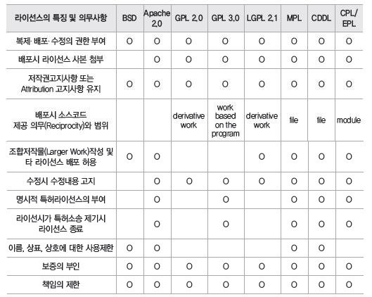

<!-- 해당 챕터를 정리한 내용을 적어주세요 -->
# package.json 톺아보기
> **package.json 이란?** 
프로젝트 설정, 의존성 관리, 실행 스크립트 등을 정의하는 역할

## 주요 필드
### name
> 프로젝트 이름을 선언하는 필드 

일반적인 경우 프로젝트의 이름은 필수가 아니며, npm에 올라온 다른 패키지명과 중복되어도 상관없다. 단, npm에 업로드할 목적이라면 npm 레지스트리 내에서 고유한 명칭을 지정해야한다.

### scope
> 이름에 사용되며, 여러 패키지 사이에 연 있는 패키지를 묶고 싶을 때 사용

스코프는 소유자(나와 조직)만 사용할 수 있다. 스코프가 있는 패키지는 node_modules에 설치될 때 스코프를 폴더로 추가하여 설치한다. ex) `node_modules/@jieun/packagename`

### version
하나의 name에는 동일한 version이 존재할 수 없다.

### description
> 패키지에 대한 설명

### keywords
> 패키지와 관련된 키워드, 문자열 배열

보통 간단한 키워드 또는 패키지가 의존성을 가지고 있는 프레임워크나 라이브러리명을 선언해둔다.

### homepage
> 패키지의 홈페이지 URL, 깃허브 주소나 별도의 소개 사이트를 기재

### bugs
> 버그를 제보할 수 있는 주소나 이메일 주소

객체나 문자열로 지정가능. 문자열로 지정할 경우 `npm bugs <패키지명>`으로 리다이렉트할 수 있다.

### license
> 패키지를 어떻게 사용할 수 있고, 어떤 제한이 있는지 알리는 필드
- MIT 라이선스 : 해당 라이선스를 사용한 제품을 반드시 오픈소스로 배포하지 않아도 된다. 가장 제한이 느슨한 라이선스
- ISC 라이선스 : npm init으로 프로젝트 생성 시 기본으로 사용되는 라이선스. 거의 제약이 없으며 제약이 상당히 간결하고 명확
- 아파치 라이선스 2.0: 특허권에 대한 위험성을 피할 수 있다.
- BDS 라이선스: 해당 저작권자의 이름과 BDS 라이선스의 내용을 함께 배포해야한다.

 

라이선스 지정 방법
- 라이선스 ID 혹은 라이선스가 적혀있는 파일의 위치 명시
- 라이선스가 없다면 "UNLICENSED"
  - 이 경우, 다른 사람이 사용하지 못하게 만든 것

### author와 contributors
> author는 1명, contributors는 여러 명 선언 가능

name, email, url 필드를 가진 person 객체를 사용하거나 하나의 문자열로 나타내면 npm이 자동으로 파싱해준다.

### funding
> 자금을 지원해주는 방법에 대한 필드

### files
> 패키지가 npm 레지스트리에 업로드 될 때 포함해야 할 파일 목록을 선언할 수 있음.

의존성으로 설치하는 경우 꼭 필요한 파일만 선택적으로 배포하거나 불필요한 파일과 디렉터리를 제외할 수 있어 패키지 크기를 줄일 수 있다.

생략 시 대부분의 파일이 포함된다. 
이 필드를 사용하더라도 .npmignore(혹은 .gitignore)에 선언된 파일이 있다면 해당 파일은 업로드가 무시된다.

패키지 최상위의 .npmignore 보다는 files가 우선되지만, 하위 패키지에서는 .npmignore에 있는 것이 우선시 되어 무시된다.

### main
> 패키지의 진입 파일. 기본 값은 index.js

### browser
> 모듈을 클라이언트 측에서 사용하려면 main대신 browser 필드 사용

browser에 의존성을 가졌다는 것을 사용자에게 알려줄 수 있다.

### bin
> 직접 바로 실행 가능한 파일의 위치를 선언하는 곳

`npm install -g <패키지명>`으로 전역 설치하면 bin 필드에 지정된 파일을 실행하는 명령어가 생성된다.
이후 해당 이름으로 실행할 수 있다. 

node.js로 실행될 파일을 bin필드에 지정했다면 해당 파일 상단에 `#!/usr/bon/env node`를 선언해야 알아서 Node.js로 실행된다.

### man
> 유닉스 시스템에서 메뉴얼을 보는 명령어로 거의 사용하지 않음

### directories
> 거의 사용하지 않음

### repository
> 실제 패키지 코드가 있는 곳

모노레포와 같이 package.json이 최상위 저장소 외에 하위 폴더에 있다면 해당 디렉터리 위치를 함께 명시해준다.

### scripts
> 기본적으로 제공하는 명령어외, 임의의 명령어를 선언해서 사용가능

운영체제에 따라 **키**=**값** 형태로 전달할 수 있으며 scripts안에서 또 다른 scripts를 실행할 수 있다.

### config
> scripts슬 실행할 때 사용할 수 있는 다양한 설정 관련 값

json 형태라 관리가 어려워 dotenv를 더 많이 사용하는 편

### dependencies
> 프로젝트가 실행되는데 필요한 외부 패키지 및 라이브러리 정의

### overrides
> 패키지 자신이 참조하고 있는 의존성 버전을 수정하고 싶을 때 유용

긴급한 보안 위협이 발생하여 빠르게 대응이 필요한 경우와 같이 의존 패키지의 버전업을 기다릴 수 없는 경우 주로 사용한다.

### engines
> 패키지가 실행 가능한 node.js 버전 명시

### os
> 패키지가 실행 가능한 운영체제를 선언하고 싶을 때 사용

배열 형태로 명시하거나 !를 사용해 사용하지 못하게 할 수 있음
아주 특별한 이유가 있지 않는다면 사용하지 않는다.

### cpu
> 특별한 cpu가 필요하다면 사용

### private
> true의 경우 절대 npm 레지스트리에 업로드하지 않는다.

### publishConfig
> 배포할 때 필요한 설정 값 선언

기본 Npm 레지스트리가 아닌 다른 곳에 배포하고 하고싶을 때

### workspaces
> 하나의 최상위 패키지 위에서 하위 여러 패키지를 관리하기 위한 방식

최상위에 하나의 node_modules와 package-lock.json이 생기는 대신, 하위에 있는 패키지들은 최상위에 있는 node_modules를 보고 참조하거나, 패키지간에 참조한다.

최근에는 다양한 성능을 제공하는 모노레포 도구가 많기 때문에 npm 워크스페이스를 사용해 모노레포를 관리하는 경우는 드물다.

### packageManager
> 프로젝트를 실행할 때 사용될 것으로 예상되는 패키지 관리자를 지정

실험적으로 운영 중인 필드로 corepack과 함꼐 유용하게 사용할 수 있다.

### type
> 어떤 모듈 형식을 사용할지 알리는 필드. 기본값은 commonjs

### exports
> main의 대안으로 설치해서 사용하는 사용자에게 패키지의 진입점을 나타낼 수 있는 필드

하위 path를 상세하게 나타내거나 조건부 exports를 나타낼 때 사용될 수 있다.

### imports
> 패키지 내부에서만 사용 가능, 특정 불러오기에 대한 별칭 지정

반드시 #으로 시작해야한다.

## package.json 생성하기
### npm init 
- 문답을 통해 생성가능. 기본값으로 생성하고 싶다면 --yes 설정

### package.json에 주석 추가하기
JSONC 파일 형식을 사용할 경우 별도의 컴파일러가 필요하다.

"//" 키를 사용하면 주석을 작성할 수 있다. 단, scripts나 dependencies에서는 주석으로 인식하지 않으니 주의가 필요하다.

## npm config와 .npmrc 살펴보기
### npm config
- _auth : npm에 접근할 수 있는 권한
- registry: 업로드 되는 데이터 베이스 주소
- engine-strict
- access
- legacy-peer-deeps: peerDependencies가 맞지 않아도 과거 npm버전과 동일하게 설치를 진행

## 결론
- package.json에 필요한 설정만 있는지 주기적으로 검토하자.
