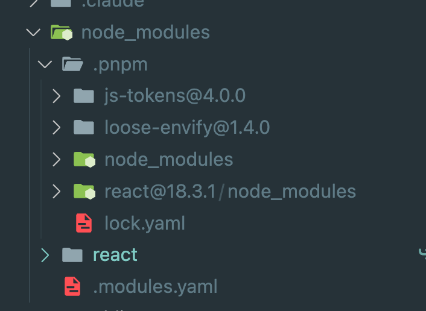

# pnpm: 디스크 공간 절약과 설치 속도의 혁신을 가져온 패키지 관리자

> 제목이 엄청 긴데 저자가 pnpm을 좋아하나 보네요..

pnpm의 가장 큰 특징은 중복된 패키지 저장을 방지하고, 디스크 사용량을 대폭 줄인다는 것이다.

## 3.3.2 특징

Pnpm은 yarn처럼 lock.yaml 파일을 가지고 있는데 다른 점으로는 dependencies 필드가 락 파일 최상단에
위치해 있어 현재 설치된 패키지의 버전을 한눈에 파악할 수 있다는 점이다.

또 다른 점으로는 버전이 `3.0.0 || 4.0.0`처럼 명시되어있다면 yarn.lock은 이를 버전 범위로 관리하는 반면에
pnpm.lock은 가능한 최상위 허용 버전으로 관리한다.

## 3.3.2.2 글로벌 스토어의 하드 링크

pnpm의 가장 큰 특징으로 많이 언급되는 것이 글로벌 스토어와 하드 링크이다.
pnpm은 각 패키지가 설치하는 의존성을 node_modules가 아닌 ~/.pnpm이라고 하는 글로벌 스토어에 저장한다.

pnpm install로 react 18.3.1을 설치해보면 node_modules 내부에 .pnpm 폴더와 react 폴더로 나뉘어져 있고 .pnpm 폴더에는 또 react, js-tokens, loose-envify, node_modules가 있다.

<div align=center>



</div>

pnpm은 평탄화된 Node_modules 구조를 피하기 위해 다음과 같은 전략을 채택했다.

1. 프로젝트의 ./node_modules에는 선언된 dependencies와 같은 직접 의존성만 위치시킨다.
2. 이 패키지들의 실제 파일은 .pnpm에 하드 링크로 연결한다.
3. 프로젝트의 직접 의존성에 필요한 패키지의 실제 원본은 ./node_modules 대신 ./node_modules/.pnpm에 평탄화해서 설치해둔다.
4. 각 패키지의 의존성은 앞서 평탄화해둔 .pnpm에 하드 링크로 참조하게 한다.

이게 어떤 뜻인지 아까 설치한 node_modules와 연결해서 보자.

react 18.3.1의 dependencies는 하나인데 바로 loose-envify이다. 그리고 이 loose-envify의 dependencies가 js-tokens이고 js-token는 dependencies가 없기 때문에 직접 의존성인 react, loose-envify, js-tokens가 .pnpm에 위치한 것이다. (1번과 3번)

node_modules의 .pnpm에 같은 depth에는 react가 설치되어있는데 이 react 내부에는 파일이 없고 .pnpm에 설치된 react를 하드 링크로 참조하고 있다. (2번과 4번)

### 3.3.2.4 콘텐츠 어드레서블 스토리지와 Copy-on-Write

pnpm의 또 다른 혁신적인 기능은 콘텐츠 어드레서블 스토리지(Content Addressable Storage, CAS)이다. 이는 Copy-on-Write(COW) 방식을 기반으로 한 파일 관리 시스템으로, 파일의 내용을 기반으로 해시값을 생성하고 이 해시값을 주소로 사용해 파일을 저장하는 방식이다.

#### Copy-on-Write의 원리

Copy-on-Write는 원본 데이터를 여러 곳에서 참조할 때 실제 복사본을 만들지 않고, 데이터가 수정될 때만 복사본을 만드는 방식이다. pnpm은 이 원리를 패키지 관리에 적용했다:

1. **공유 단계**: 여러 프로젝트가 같은 패키지를 참조할 때, 실제로는 하나의 원본만 존재하고 모든 프로젝트가 이를 하드 링크로 참조한다.
2. **복사 단계**: 패키지 파일이 수정되거나 다른 버전이 필요할 때만 새로운 복사본을 생성한다.

pnpm에서 패키지를 설치할 때, 각 패키지의 파일들은 그 내용의 SHA-1 해시값으로 식별된다. 예를 들어, `react@18.3.1` 패키지의 `index.js` 파일은 해당 파일의 내용을 해싱한 결과값으로 글로벌 스토어에 저장된다.

```bash
~/.pnpm/store/v3/files/
├── a1/b2c3d4... (react의 index.js)
├── e5/f6g7h8... (react의 package.json)
└── i9/j0k1l2... (다른 패키지의 파일)
```

#### COW 기반 CAS의 장점

1. **완벽한 중복 제거**: 동일한 내용의 파일은 해시값이 같기 때문에 한 번만 저장된다. 여러 프로젝트에서 같은 버전의 패키지를 사용하더라도 실제로는 하나의 파일만 존재한다.

2. **무결성 보장**: 파일의 내용이 변경되면 해시값도 달라지므로, COW 방식에 의해 새로운 복사본이 생성되고 파일 손상이나 변조를 자동으로 감지할 수 있다.

3. **지연된 복사**: 파일이 실제로 수정되기 전까지는 복사본을 만들지 않으므로 메모리와 디스크 공간을 효율적으로 사용한다.

4. **효율적인 캐싱**: 한 번 다운로드된 파일은 해시값으로 식별되어 재사용되므로, 같은 패키지를 다시 설치할 때 다운로드할 필요가 없다.

실제로 pnpm으로 여러 프로젝트를 관리해보면 이 차이를 체감할 수 있다. npm으로 10개 프로젝트에 각각 react를 설치하면 10개의 react 복사본이 생기지만, pnpm은 COW 방식으로 하나의 react만 저장하고 나머지는 하드 링크로 참조한다. 만약 어떤 프로젝트에서 react 파일을 수정한다면, 그때만 새로운 복사본이 생성된다.

이런 COW 기반의 CAS 구조 덕분에 pnpm은 npm 대비 최대 70%까지 디스크 공간을 절약할 수 있고, 설치 속도도 현저히 빨라진다.
