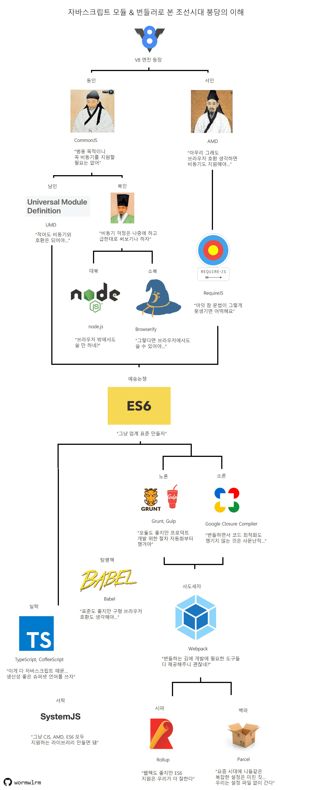

# 자바스크립트 모듈화의 역사와 발전

- 소프트웨어 개발에서 **모듈**은 프로그램을 작은 기능 단위로 나누어 구성하는 중요한 요소다.
- **모듈화**는 애플리케이션을 효율적으로 구축하는 방법으로, 코드를 작은 단위로 분할하고 추상화하여 유지보수성을 높이고 재사용성을 향상시킨다.
- **모듈 시스템**은 프로그램을 여러 모듈로 나누고 이를 체계적으로 관리하기 위한 규칙과 방법(모듈 정의, import 방식, 의존성 관리, 네임스페이스 등)을 제공한다.
- 초기 자바스크립트에는 모듈화 개념이 없었다. 웹이 발전하면서 JS가 폭넓게 사용되자 모듈 시스템 필요성이 대두되었고, CommonJS, AMD, UMD, ESModule 등 다양한 모듈 시스템이 등장했다.
- 아래에서는 JS 모듈화의 초기 배경과 발전 과정을 살펴본다.

## 자바스크립트 모듈화의 배경

### 1997년: ECMAScript 표준 제정

- 초기 브라우저마다 다른 스크립트 언어가 등장하면서 호환성 문제가 발생했다.
- 이를 해결하기 위해 ECMA(European Computer Manufacturers Association)에서 자바스크립트의 표준인 ECMAScript를 제정했고, 이로써 모든 브라우저가 동일한 JS 표준을 따르게 됐다.

### 1999년: Ajax 등장

- Ajax(Asynchronous JavaScript And XML)의 등장으로 브라우저와 서버가 비동기적으로 데이터를 교환할 수 있게 되면서 웹페이지 동작 방식이 확장됐다.
- 기존에는 변화가 생길 때마다 전체 HTML을 다시 받아와 리렌더링해야 했는데, Ajax를 활용하면 필요한 데이터만 서버에서 받아와 클라이언트에서 처리할 수 있었다.
- 이를 통해 불필요한 화면 재로딩이 줄었고, SPA(Single Page Application)의 탄생을 촉발했으며 Angular, React, Vue.js 같은 프론트엔드 프레임워크와 라이브러리의 등장을 이끌었다.

### 2008년: 구글 V8 자바스크립트 엔진 등장

- 2005년 구글 맵스에서 JS와 Ajax를 활용해 데스크톱 애플리케이션에 준하는 성능과 부드러운 화면 전환을 구현하면서, JS의 웹 애플리케이션 개발 언어로서의 가능성이 확인됐다.
- 웹 애플리케이션이 확산되면서 클라이언트 측 작업량과 복잡성이 증가했고, JS 성능의 중요성이 커졌다.
- 2008년 구글은 **V8 엔진**을 출시해 브라우저에서 실행되는 JS 코드의 속도를 크게 개선했다.
- 이어서 라이언 달(Ryan Dahl)이 JS를 브라우저 외부에서도 실행할 수 있는 **Node.js**를 개발해 웹 개발의 확장성과 효율성을 크게 높였다.

## 모듈화 이전의 자바스크립트

- 초기 JS는 HTML에서 간단한 동적 기능을 구현하는 용도였기에 엄격한 시스템이나 표준이 없었다.
- 하나의 파일에 모든 기능을 구현하는 방식은 다음과 같은 문제를 유발했다.
  1. 전역 변수 충돌 문제
  2. 복잡한 의존성 관리
  3. 렌더링 지연 문제
- 이런 문제를 해결하기 위해 CommonJS, AMD, UMD, ESModule 등 다양한 모듈 시스템이 등장했다.

## 자바스크립트 모듈의 여러 시도들

### 즉시 호출 함수 표현식(IIFE, Immediately Invoked Function Expression)

- IIFE를 활용해 스코프를 분리함으로써 접근 가능한 변수와 함수를 제한해 모듈 시스템을 흉내냈다.
- 그러나 IIFE만으로는 전역 변수 문제나 의존성 관리 문제를 완전히 해결하기 어려웠다.

### AMD와 RequireJS – 브라우저 환경

- AMD(Asynchronous Module Definition)는 모듈을 비동기적으로 로드하고 정의하는 JS 모듈 표준으로, 주로 브라우저에서 사용됐다.
- **RequireJS**는 AMD를 구현한 대표적인 라이브러리 중 하나다.
- 모듈을 비동기적으로 로드해 여러 모듈을 병렬로 불러올 수 있고, 페이지 초기 로딩 속도를 향상시켰다.
- 의존성을 명시적으로 정의하고, 의존 모듈이 모두 로드된 후 실행할 수 있다.

  ```jsx
  // someModule.js
  define(["dependency1", "dependency2"], function (dependency1, dependency2) {
    return "someModule";
  });

  // main.js
  require(["someModule"], function (someModule) {
    console.log(someModule);
  });
  ```

- 대규모 애플리케이션에서 모듈화와 성능 최적화에 유리했지만, 문법이 복잡하고 서버 환경에서 제약이 있어 점차 사용 빈도가 줄었다.

### CommonJS – 서버 환경

- 브라우저 외부 환경에서 JS를 사용하기 위해 설계된 모듈 시스템이다.
- 모듈을 동기적으로 로드하므로 파일 시스템 접근이나 네트워크 요청 등 서버 사이드 I/O 작업에 적합했다.
- Node.js가 CommonJS를 채택했다.
- `module.exports`와 `require` 문법을 사용한다.

### UMD(Universal Module Definition)

- AMD와 CommonJS를 모두 지원해 다양한 환경에서 호환성을 제공하는 패턴(템플릿)이다.

  ```jsx
  (function (root, factory) {
    if (typeof define === "function" && define.amd) {
      // AMD 환경
      define(["dependency"], factory);
    } else if (typeof module === "object" && module.exports) {
      // CommonJS 환경
      module.exports = factory(require("dependency"));
    } else {
      // 전역 객체에 할당
      root.returnExports = factory(root.dependency);
    }
  })(typeof self !== "undefined" ? self : this, function (dependency) {
    return {
      // 모듈의 공개 API
    };
  });
  ```

- 하지만 다양한 조건문과 불필요한 코드 증가, 성능 저하, 유지보수 복잡성 등의 단점으로 인해 사용이 줄었다.

### SystemJS

- 동적으로 모듈을 로드하고 실행하는 JS 로더다.
- 브라우저에서 모듈 간 의존성을 해결하고, 필요한 시점에 모듈을 로드할 수 있어 성능 최적화에 유용하다.
- AMD, CommonJS, UMD, ESModule 등 다양한 형식을 지원해 호환성이 좋다.
- 하지만 표준이 아니고, 복잡성과 성능 부담이 있어 점차 사용 빈도가 줄고 있다.

### ESModule

- 위와 같은 ‘모듈 시스템 춘추전국시대’를 거쳐, ES6에서 표준 모듈 시스템이 도입됐다.
- 브라우저와 Node.js 모두에서 동작하며, JS 언어 자체에 통합됐다.
- `export`와 `import` 키워드를 사용해 모듈을 내보내고 가져온다.

## 오늘날의 자바스크립트 모듈 시스템

- 현재 가장 널리 쓰이는 것은 **CommonJS**와 **ESModule**이다.
  - CommonJS: 주로 서버 사이드(Node.js)
  - ESModule: 주로 클라이언트 사이드(브라우저)
- 표준 모듈 시스템인 ESModule을 브라우저와 서버 환경 모두에서 사용하려는 흐름이 점점 확대되고 있다.

## 모듈 시스템 장단점 비교

| 모듈 시스템 | 장점                                          | 단점                                              |
| ----------- | --------------------------------------------- | ------------------------------------------------- |
| IIFE        | 간단히 스코프 분리 가능, 구현이 쉬움          | 전역 변수 문제 완전 해결 불가, 의존성 관리 어려움 |
| AMD         | 비동기 로드로 성능 향상, 브라우저 환경 최적화 | 문법 복잡, 서버 환경 제약                         |
| CommonJS    | 간단한 문법, Node.js와 궁합 좋음              | 동기 로드로 브라우저 성능 저하 가능               |
| UMD         | 다양한 환경 호환성 확보                       | 코드 복잡, 불필요한 조건문 증가                   |
| SystemJS    | 다양한 모듈 형식 지원, 동적 로드 가능         | 표준 아님, 복잡성과 성능 부담                     |
| ESModule    | 표준 지원, 브라우저/서버 모두 사용 가능       | 구형 브라우저 호환성 문제(트랜스파일 필요)        |

## [JavaScript 번들러로 본 조선시대 붕당의 이해](https://wormwlrm.github.io/2020/08/12/History-of-JavaScript-Modules-and-Bundlers.html)

<div align=center>



</div>
