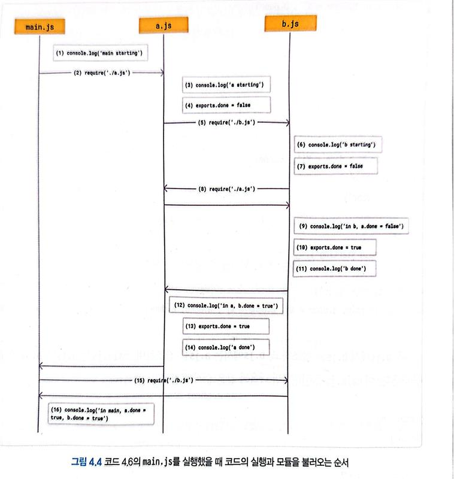

<!-- 해당 챕터를 정리한 내용을 적어주세요 -->

# CommonJS란 무엇일까?

> 서버에서 자바스크립트를 활용하기 위해 등장한 모듈 시스템

## CommonJS의 탄생 배경

자바스크립트를 서버에서 확장성 있게 활용하기 위한 요구사항

1. 상호 호환되는 표준 라이브러리가 필요
2. 서버와 웹 간 상호작용할 수 있는 표준 인터페이스 필요
3. 다른 모듈을 로드할 수 있는 표준 필요
4. 코드를 패키지화하고 배포/설치 하는 방법 필요
5. 패키지를 설치하고, 패키지 간 의존성을 해결하는 패키지 저장소 필요

=> 자바스크립트만의 모듈 시스템이 필요하다는 결론

본래 CommonJS는 ServerJS라는 이름으로 시작했으나 다양한 환경에서 사용할 수 있는 모듈 시스템이 되기 위해 CommonJS로 이름을 변경했다.

## CommonJS의 명세

CommonJS로 모듈 시스템을 구축하기 위한 세가지 명세

1. 독립적인 실행 영역
   - 모든 모듈은 자신만의 독립적인 실행 영역을 가진다.
     => 각 모듈은 외부와 분리되어 동일한 변수 이름을 사용하더라도 다른 모듈에 영향을 주지 않는다
2. exports 객체로 모듈 정의
   - 외부로 공개할 기능만 exports 객체로 정의할 수 있다.
     => 필요한 기능만 외부에 노출
3. require() 함수로 모듈을 사용
   - require()의 첫 번째 인수로 불러올 모듈명을 전달하면 해당 모듈의 exports 객체가 반환됨 => 다른 파일에서 정의된 기능을 쉽게 가져와 사용 가능

> [!NOTE]
>
> CommonJS는 모듈이 로컬 디스크 내에 있어 바로 불러올 수 있는 환경을 전제로 한다.
> 그러나 브라우저에서는 필요한 모듈을 로드할 때까지 화면이 멈춰버리는 단점이 있다.
>
> CommonJS는 서버 모듈을 비동기적으로 클라이언트에 전송할 수있는 모듈 전송 포맷을 추가로 정의해 비동기적으로 서버 모듈을 로드할 수 있게 했다.
>
> 하지만 사실상 CommonJS를 네이티브로 브라우저에서 사용할 순 없으니 반드시 번들러의 도움을 받아야 한다.

## Node.js의 CommonJS

Node.js는 CommonJS가 등장한 년도와 동일한 해에 등장했는데 CommonJS를 선택해 모듈 시스템을 채택했고, 이는 Node.js의 초기 생태계를 구축하는데 많은 역할을 했다.
Node.js의 CommonJS 도입은 여러 이유로 선택되었고 여러 이점을 제공했다.

1. 다양한 기능의 필요성
   - 서버 사이드 개발에서 요구되는 다양한 기능을 효과적으로 제공하기 위해 필수적인 모듈시스템 => CommonJS는 이러한 기능을 구조화해서 제공할 수 있는 환경 마련
2. 논블로킹 I/O 모델과의 호환
   - 비동기 처리를 위해 I/O모델을 채택해 동시 연결을 효과적으로 처리하도록 설계. => CommonJS의 동기적 로딩 방식은 블로킹 처리를 간단하게 도움
3. CommonJS의 보급도
   - 이미 많은 개발자가 CommonJS를 사용중

### CommonJS 파일 규칙

Node.js가 특정 파일을 CommonJS 모듈로 인식하고 해석하기 위한 판단 규칙

1. require()가 사용된 파일들
2. 가장 가까운 package.json의 type 필드가 'CommonJS'인 하위 .js 파일들
3. .cjs 확장자로 끝나는 파일들

### 모듈 내보내기

```
// circle.js
const {PI} = Math
export.area = (r) => PI * r ** 2
export.circumference = (r) => 2 * PI *r
```

```
//index.js
const circle = require('./circle.js')
console.log(circle.area(5))//원의 넓이
console.log(circle.circumference(5))//원의 둘레
```

exports 는 전역변수처럼 사용할 수 있지만 실제로는 전역변수가 아님 exports는 모듈 스코프에만 존재하는 객체

=> Node.js는 모든 모듈을 함수로 감싸서 실행해 다른 모듈과 격리된 환경에서 동작하도록 하며 이를 모듈 래퍼라고 함.

래퍼 덕분에 모듈간 전역 변수 충돌 없이 독립적인 코드 구성 가능

#### module.exports

1. require() 함수는 module.exports를 반환한다.
2. exports가 단독으로 사용되면 require() 함수는 module.exports와 동일한 결과를 반환하지만 함께 사용하면 module.exports의 값만 반환한다.

exports와 module.exports는 기본적으로 동일한 객체를 참조한다. 그러나 exports에 새로운 객체를 직접 할당한다면 module.exports와의 참조가 끊어져 독립적인 객체가 된다.

> exports와 module.exports를 따로 둔 이유?
>
> 모듈 자체를 하나의 인스턴스로 활용할 가능성을 열어두기 위해서!
> exports에 새로운 객체로 직접 할당하면 module.exports와의 연결이 끊어지고, 모듈을 내보내고 싶다면 Module.exports에 직접 할당하는 방식으로 해야함. 이를 통해 모듈이 클래스 자체로 동작할 수 있음.

#### 모듈 래퍼와 모듈 스코프

- 모듈 래퍼는 모듈의 코드가 실행되기 전 모듈을 감싸는 함수
- 모듈 코드는 모듈 래퍼의 스코프 내부에서만 유효하며 이 스코프를 모듈 스코프 라고 함.

모듈 래퍼로 감싸서 함수를 공개할 때 생기는 이점

1. exports로 할당되지 않은 모듈 내부의 로컬 변수나 함수가 외부로부터 숨겨진다. (전역 변수가 오염될 가능성이 사라짐)
2. 모듈에 고유한 정보를 담은 변수를 자동으로 제공해 외부에서 모듈에 관한 정보를 쉽게 사용할 수 있음.
   - module, exports, require, **filename, **dirname

### 모듈 가져오기

```
function require(moduleName) {
    const module = {exports: {}} //기본적으로 빈 객체 할당

    ;((module, exports) => {
       const circle = {
        area: ...,
        circumference: ...
       }

        // exports에 모듈 코드 할당
        exports.area = circle.area
        exports.circumference = circle.circumference

        // module.exports에 모듈 코드를 할당
        module.exports = circle
    })(module, module.exports)

    return module.exports // module.exports를 반환
}
```

require()은 첫번째 인수인 모듈 지정자를 기반으로 파일을 찾는 규칙을 따름

1. 파일 모듈

   - require() 함수는 해당 파일을 불러옴 (절대경로 상대경로 모두 가능)
   - 확장자를 생략할 경우 .js, .json, .node 순서대로 확장자를 붙여 파일을 찾음. (이외의 확장자는 반드시 명시)

2. 모듈로 정의된 폴더

   - 폴더를 require()의 인수로 사용할 경우
     - 폴더의 package.json 파일에 main이 정의되어 있으면 해당 파일
     - 없으면 해당 폴더의 index.js / index.node
     - 없으면 에러 발생

3. node_modules 폴더
   - require() 대상 모듈이 코어 모듈이나 파일 경로가 아니면 현재 모듈의 디렉터리에서 /node_modules 폴더를 찾아 순차적으로 탐색
     - 없으면 부모의 /node_modules를 반복해 파일 시스템 최상위 까지 반복(트리 역탐사)
4. 전역 폴더
   - 파일모듈, 모듈로 정의된 폴더, node_modules에서도 찾지 못했는데 NODE_PATH 환경 변수가 설정되어있다면 해당 경로에서 추가로 탐색 진행
   - 현재는 안정성과 일관성을 위해 NODE_PATH 사용을 권항하지 않음
5. 코어 모듈
   - node.js에서 기본적으로 제공되는 모듈
   - node: 접두어를 사용해 require()을 참조하면 내장된 모듈 구현

### 동기적으로 실행되는 require() 함수

require()는 동기적으로 동작해 Node.js에서 모듈을 가져올 때 다음과 같은 특징을 보인다.

1. 모듈 내에서 발생하는 여러 동작을 동기적으로 완료한 후에 내보낸 값 사용 가능
2. 빌드 시점에는 module.exports의 정보 중 무엇을 사용할지 알 수 없으며 런타임에서만 알 수 있다.
3. 런타임 때 호출되니 코드 어디서나 호출가능하고, 조건부 호출도 가능하다.
4. 인수로 전달하는 모듈 경로또한 동적으로 할당 할 수 있다.

### require.cache

require()로 불러온 모듈은 한 번 로딩된 이후 캐시에 저장된다.
모듈이 캐싱된 정보는 require.cache 객체에서 확인할 수 있고 모듈을 로드하기 전 캐싱된 정보가 있다면 이를 반환하고 없다면 모듈을 export와 module.exports에 할당한다.

단순한 키-값 쌍의 객체라 추가, 수정, 삭제가 가능하고 모듈을 절대 경로를 기준으로 캐시를 관리한다.

윈도우와 같은 대소문자 구분이 없는 파일 시스템의 경우는 대소문자가 다른 경로로 모듈을 호출하면 동일한 모듈이라도 각기 다른 모듈로 취급한다.

Node.js의 코어 모듈은 require.cache에서 특이한 동작 방식을 보인다. 코어 모듈도 캐시에 저장된 객체를 다른 객체로 덮어 쓸 수 있지만, node: 접두어를 붙여 module.builtinModules의 모듈을 참조해야지만 실제 내장 모듈 구현체를 사용할 수 있다.

이 모듈은 require.cache를 우회해서 내장된 모듈을 반환하므로 cache의 값과 상관없이 언제나 실제 모듈의 구현체를 사용할 수 있다.

### 순환참조

CommonJS는 require() 함수의 두가지 특징을 이용해 순환참조 문제를 해결

1. require()함수는 모듈을 동기적으로 불러오기 때문에 한번에 하나씩 처리.
2. require()함수는 순환 참조에 의해 다시 호출 될 때 이미 캐싱된 모듈이 반환되어 무한 로딩이 발생하지 않음

순환참조가 발생해도 프로그램이 멈추진 않지만 가능하면 피하자

```
//a. js
console.log('a starting`)
exports.done = false
const b = require('./b.js')
console.log('in a, b.done = %j', b.done)
exports.done = true
console.log('a.done)

//b.js
console.log('b starting')
exports.done = false
const a = require('./a.js')
console.log('in b, a.done = %j', a.done)
exports.done = true
console.log('b.done)

//main.js
console.log('main starting')
const a = require('./a.js')
const b = require('./b.js')
console.log('in main, a.done= %j, b.done=%j', a.done, b.done)
```

```
main starting
a starting
b starting
in b, a.done = false
b done
in a, b.done = true
a done
in main, a.done = true, b.done = true
```



모듈이 완전히 실행되지 않은 상태에서도 캐싱이 발생하기 때문에 불완전한 데이터를 참조할 수 있음

순환 의존성은 호출 순서나 의존관계의 복잡도에 따라 일관되지 않은 결과를 반환할 수 있음으로 피하자

## 소스코드를 CommonJS로 빌드

- 번들링: 의존 관계에 있는 자바스크립트 파일을 압축하고 난독화해서 하나의 파일로 통합하는 과정
- 번들러: 번들링을 수행하는 도구
- 트리셰이킹: 실제로 사용하지 않는 모듈을 제거해서 불필요한 코드를 식별하고 삭제하는 기술

### 모듈 래퍼는 클로저를 생성한다

모듈 래퍼는 외부에서 모듈을 사용할 때마다 클로저를 생성하는 것과 같다.
선언된 환경에서 메모리에 유지해야하므로 메모리 사용 비용이 발생한다.
서버에서는 모든 모듈이 로컬 디스크에 존재해 문제되지 않지만 브라우저에서는 매번 클로저를 생성하고 참조하는 방식이 문제가 된다.

이를 해결하기 위해 일부 번들러는 하나의 클로저로 통합해서 require() 호출로 인한 성능 문제를 줄이기도 한다.

### require()는 런타임에 사용할 모듈이 결정된다.

단일 클로저로 통합하는 경우 트리셰이킹이 어려워진다.

### 트리셰이킹에 대한 오해

require()이 실행시점까지 어떤 모듈을 불러오는지 알 수 없다는 이유로 CommonJS는 트리셰이킹을 하지 않는다고 생각하는 경우가 많다.

하지만 exports 객체에 모듈을 동적으로 할당하지 않는다면 가능하다.
혹은 동적으로 모듈을 불러오지 않도록 제한하는 플러그인을 사용해도 가능해진다.

그러나 대부분의 CommonJS 코드는 동적 require()를 사용하기 때문에 트리셰이킹이 중요하다면 ESModule형식으로 코드를 작성하거나 CommonJS를 ESModule로 변환하는 도구를 사용하자.

