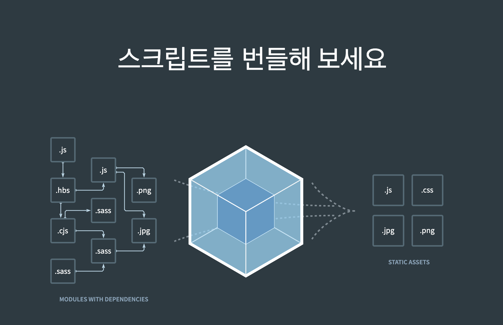

<!-- 해당 챕터를 정리한 내용을 적어주세요 -->

# 6.2 웹서비스 번들의 표준, 웹팩

## 웹팩 소개 및 주요 특징

> 웹팩은 모던 자바스크립트 애플리케이션을 위한 번들러이다.

하나의 애플리케이션을 처리할 때 시작 지점을 기준으로 프로젝트에 필요한 모든 모듈을 매핑한 다음, 이를 하나 이상의 번들 파일로 만들어 웹 애플리케이션에서 바로 사용할 수 있게 제공함.

- 다양한 모듈 번들링:HTML, 자바스크립트, CSS, 이미지, 폰트 등 모든 파일을 모듈로 통합해서 하나 이상의 번들로 묶음
- 코드 분할: 단순히 하나로 묶는 것 뿐만 아니라 필요할 때만 로드되는 청크로 분리하는 코드 분할도 가능
- 로더: 다양한 파일 형식을 처리할 수 있는 별도 로더 제공
- 플러그인: 로더가 파일을 불러오기 위함이라면, 플러그인은 웹팩에 다양한 기능을 추가하고 프로세스를 확장할 수 있게 도와준다.
- 개발환경 지원: 프로덕션을 위한 모듈 번들링 뿐만 아니라 개발 과정에서 실시간으로 번들을 확인할 수 있는 HMR 기능도 제공함으로써 개발 경험을 향상시킨다
- 최적화: 트리 셰이킹, 코드 압축, 난독화 등 다양한 방식으로 자바스크립트 애셋을 최소한의 크기로 압축한다.

## 웹팩의 기본 개념과 동작 원리

### 의존성 그래프

패키지 관리자가 package.json에 선언돼 있는 dependencies, devDependencies, peerDependencies 등을 기반으로 자바스크립트 패키지에 어떻게 의존하고 있는지 그래프로 나타내는 것 처럼 웹팩은 번들의 시작점을 기준으로 하나의 파일이 다른 파일이 의존할 때마다 이를 의존성으로 간주해서 이들 간의 그래프를 생성함

- 자바스크립트라면 이를 가능한 작은 수의 번들로 묶거나 애플리케이션에 의존성으로 제공함



구성파일에 선언돼 있는 모듈 목록 및 최초 시작점을 토대로 애플리케이션을 재귀적으로 빌드해서 필요한 모듈을 설정에 맞춰서 한 개 이상의 번들 파일로 합침. 이 작업을 위해 필요한게 의존성 그래프

### 엔트리

- 의존성 그래프를 생성하기 위해 사용되는 최조 진입점.
  일반적으로 `./scr/index.js`가 기본값이지만 커스터 마이징 가능

```
module.exports = {
    entry: './~~~',
}
```

SPA에서는 하나의 엔트리 포인트가 일반적이지만 여러 페이지를 제공하는 경우 엔트리 포인트 또한 여러 개를 설정할 수 있음

`dependOn` 옵션을 사용하면 여러 모듈이 공유할 수 있는 또 다른 엔트리 파일을 만들 수 있다.

```
module.exports = {
    entry: {
        app: {import: './app.js', dependOn:'main'},
        main:['next.js']
    }
}
```

main이라는 별도 엔트리 포인트를 만들어 NextJS서비스를 구동하는데 필요한 Next.js 관련 파일을 모두 별도로 분리

### 아웃풋

- 생성된 번들 파일을 어디에 생성할지, 그리고 그 파일 이름을 어떻게 지정할지 선언할 수 있는 설정 기본값은 `./dist/main.js`

```
module.exports = {
    output: {
        path:path.resolve(__dirname, 'dist'),
        filename: 'main.js'
    }
}
```

여러 파일을 만들고 싶다면 [substitution] 문법 사용

- 각각 해당 entry에 해당하는 output이 생성

```
module.exports = {
    output: {
        path:path.resolve(__dirname, 'dist'),
        filename: '[name].js'
    }
}
```

여기에 [contenthash]를 추가하면 파일 내용 기반 해시값 생성으로, 파일의 내용이 변경되면 새로운 해시값이 생성되어 파일명이 변경

- 캐싱 최적화, 빌드 안정성 보장

### 로더

다양한 유형의 파일을 처리할 수 있는 것은 로더 덕분
앞부터 순서대로 로더를 읽음

```
module: {
    rules: [
      {
        test: /\.[jt]sx?$/,
        loader: 'esbuild-loader',
        exclude: /node_modules/,
        options: {
          target: 'esnext',
        },
      },
      {
        test: /\.css$/i,
        use: ['style-loader', 'css-loader'],
      },
      {
        test: /\.svg$/i,
        issuer: /\.[jt]sx?$/,
        use: ['@svgr/webpack', 'url-loader'],
      },
    ],
  },
```

주로 사용되는 로더

- babel-loader
- file-loader
- ts-loader
- sass-loader
- css-loader
- style-loader

### 플러그인

웹팩 기능을 확장하기 위함

주로 사용되는 플러그인

- DefinePlugin: 특정 전역 변수 정의
- HotModuleReplacementPlugin: HMR 활성화
- HTMLWebpackPlugin: 번들링된 자바스크립트를 일일이 삽입하지 않아도 된다.
- MiniCssExtractPlugin: css 최적화(번들로 생성되는 자바스크립트와 쌍으로 이루는 css파일을 내보냄)
- TerserWebpackPlugin: 압축
- BundleAnalyzerPlugin: 아웃풋 파일 시각화

### mode

내장된 환경변수로 내부 최적화 가능

'production'|'development'|'none'

### 브라우저 호환성

ES5가 호환되는 모든 브라우저를 지원

동적 import 쓰려면 Es6의 Promise가 필요하므로 별도의 폴리필이 필요함
